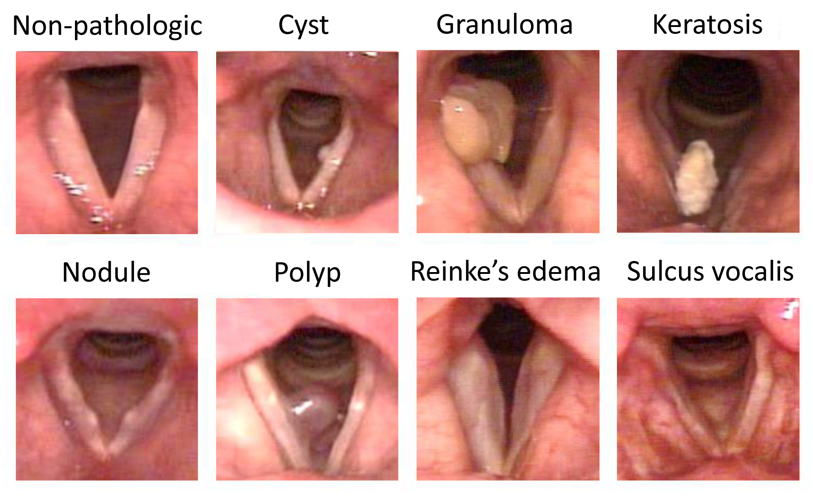
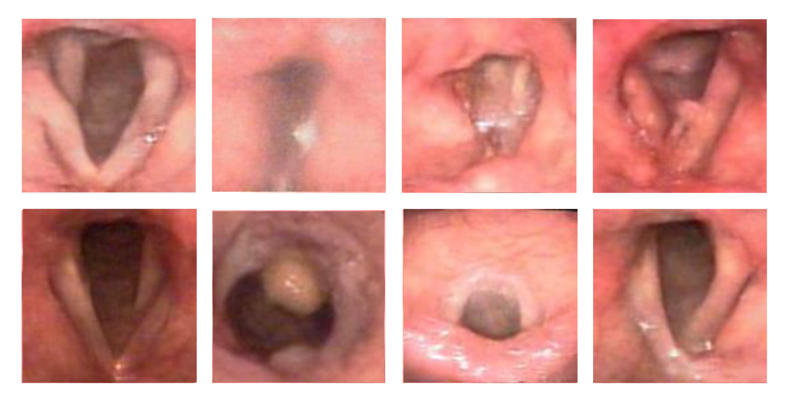
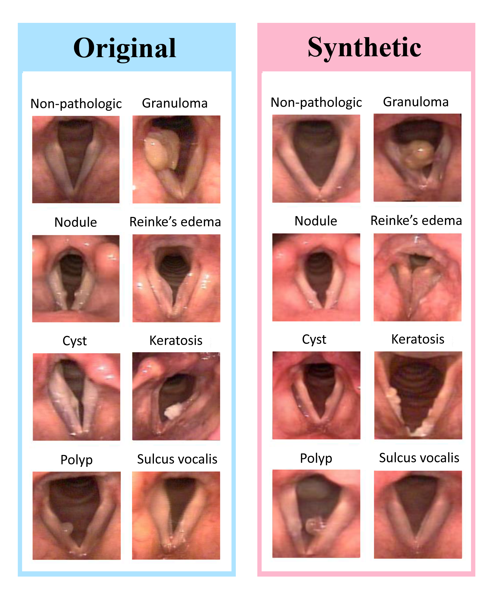

# Enhancing Laryngeal Lesions Image Classification with Synthetic Data

This repository contains the implementation and resources for the paper **["Feasibility of Improving Vocal Fold Structural Pathology Image Classification by Generating Synthetic Images Using Denoising Diffusion Probabilistic Models: A Pilot Study."](https://link.springer.com/article/10.1007/s00405-025-09443-4)**

## Authors

- Iman Khazrak
- Shahryar Zainaee
- Mostafa M. Rezaee
- Mehran Ghasemi
- Robert C. Green

## Overview

This pilot study evaluates whether DDPM-generated synthetic laryngeal images can improve classification of vocal fold structural pathologies (VFSP). Using 404 expert-labeled laryngoscopic images, we trained DDPMs to generate additional high-quality images that augmented the original dataset, and then trained VGG16 and ResNet50 classifiers on: (1) original-only and (2) original+synthetic data. Models trained only on the original dataset failed to converge, whereas training with the augmented dataset converged reliably with lower loss and higher accuracy for both binary (with/without pathology) and multi-class (seven VFSP classes) tasks. These results suggest DDPM-generated images can enhance VFSP classification and may support voice disorder screening/diagnosis.

### Dataset summary
- Original images: 404 (expert-reviewed, 7 VFSP classes + no-pathology)
- Synthetic images: 4,180 (class-balanced augmentation via DDPM)
- Classes: no pathology, nodule, cyst, polyp, sulcus vocalis, Reinke’s edema, keratosis, granuloma

### Methods (brief)
- Source: 607 de-identified laryngoscopic videos (2014–2017), curated to 404 representative frames (240×240 JPG) by two SLP experts (κ = 0.86).
- Generation: DDPM trained on OSC Pitzer V100 GPUs; cosine variance schedule; per-class image generation to balance distribution.
- Classification: VGG16 and ResNet50 trained on (a) original-only and (b) original+synthetic datasets; evaluated on binary and multi-class setups.

<!-- ## About the Paper

This study addresses the challenges of imbalanced datasets in vocal fold (VF) pathology classification by leveraging Denoising Diffusion Probabilistic Models (DDPMs) to generate high-quality synthetic images. Using a dataset of 404 laryngoscopic images, DDPMs augmented the data to improve model training. Two convolutional neural networks, VGG16 and ResNet50, were evaluated for binary (with/without pathology) and multi-class (seven pathologies) classification tasks. Models trained solely on the original dataset failed to converge, while those trained on the augmented dataset achieved significant improvements in accuracy and loss. These findings demonstrate the feasibility of DDPM-generated synthetic images in enhancing VF pathology classification and supporting voice disorder diagnosis. -->

## Installation

To set up the environment and dependencies required to run this project, first create the environment using the provided `environment.yml` file:

```bash
conda env create -f environment.yml
conda activate ddpm_pytorch
```

## Results

- **Convergence**: Training on original-only data failed to converge; adding DDPM-generated images enabled stable convergence.
- **Performance**: Augmented training achieved lower loss and higher accuracy for both binary and seven-class classification.
- **Takeaway**: Class-balanced DDPM augmentation improved model learnability and overall metrics.

### Visual Results

#### Training Loss and Accuracy


#### Visual Appearance of Pathologies


#### Unrealistic Synthetic Images (Removed)


#### Original vs Synthetic Examples


#### Binary Classification Results


#### Multi-class Classification Results


#### Confusion Matrices


## Usage

1. Clone this repository:

   ```bash
   git clone https://github.com/imankhazrak/DDPM_Laryngeal-Lesions
   cd DDPM_Laryngeal-Lesions
   ```

2. Activate the environment:

   ```bash
   conda activate ddpm_pytorch
   ```

3. Follow the instructions in the `notebooks` directory to reproduce the results from the paper.

## Citation

If you use this repository in your work, please cite the following:

```bibtex
@article{khazrak2025laryngeal,
  title={Feasibility of Improving Vocal Fold Structural Pathology Image Classification by Generating Synthetic Images Using Denoising Diffusion Probabilistic Models: A Pilot Study},
  author={Iman Khazrak, Shahryar Zainaee, Mostafa M. Rezaee, Mehran Ghasemi, Robert C. Green},
  year={2025},
  journal={Pending Publication},
  url={https://github.com/imankhazrak/DDPM_Laryngeal-Lesions}
}
```
