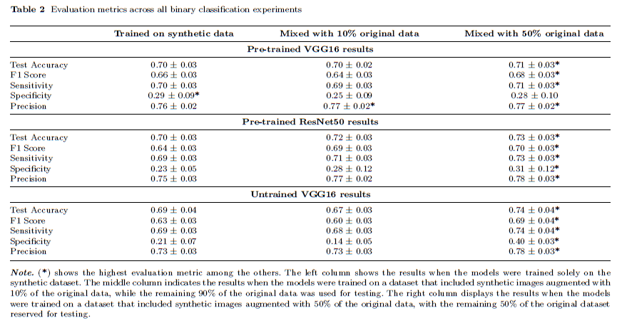
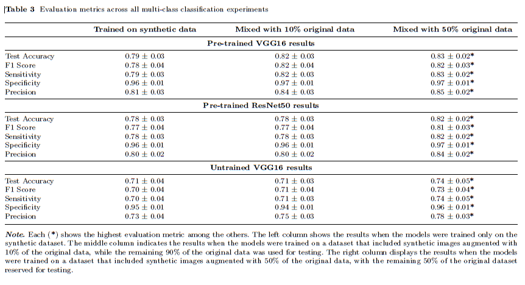
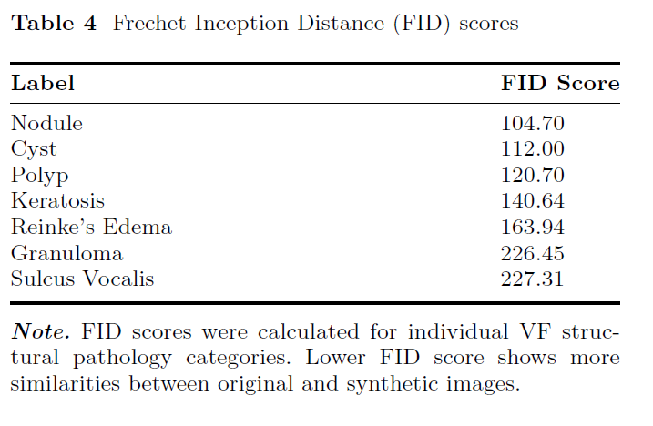

# Enhancing Laryngeal Lesions Image Classification with Synthetic Data

This repository contains the implementation and resources for the paper **"Feasibility of Improving Vocal Fold Structural Pathology Image Classification by Generating Synthetic Images Using Denoising Diffusion Probabilistic Models: A Pilot Study."**

<!-- ## About the Paper

This study addresses the challenges of imbalanced datasets in vocal fold (VF) pathology classification by leveraging Denoising Diffusion Probabilistic Models (DDPMs) to generate high-quality synthetic images. Using a dataset of 404 laryngoscopic images, DDPMs augmented the data to improve model training. Two convolutional neural networks, VGG16 and ResNet50, were evaluated for binary (with/without pathology) and multi-class (seven pathologies) classification tasks. Models trained solely on the original dataset failed to converge, while those trained on the augmented dataset achieved significant improvements in accuracy and loss. These findings demonstrate the feasibility of DDPM-generated synthetic images in enhancing VF pathology classification and supporting voice disorder diagnosis. -->

## Installation

To set up the environment and dependencies required to run this project, first create the environment using the provided `environment.yml` file:

```bash
conda env create -f environment.yml
conda activate laryngeal-env
```

<!-- ## Results

### Key Findings
- **Synthetic Dataset**: A total of 4,180 high-quality synthetic images were generated and reviewed by experts to ensure anatomical fidelity.
- **Binary Classification**: Models trained with augmented datasets achieved higher accuracy and faster convergence compared to training with the original dataset alone.
- **Multi-class Classification**: Combining synthetic and original data significantly improved performance metrics, including F1 Score, precision, and sensitivity.


### Visual Results

#### Training Loss and Accuracy


#### Binary Classification Results


#### Multiple Classification Results



#### Confusion Matrices
<!--  -->
<!--  -->


<!-- #### FID Scores -->

<!--  --> 

## Usage

1. Clone this repository:

   ```bash
   git clone https://github.com/imankhazrak/DDPM_Laryngeal-Lesions
   cd repository-name
   ```

2. Activate the environment:

   ```bash
   conda activate ddpm_pytorch
   ```

3. Follow the instructions in the `notebooks` directory to reproduce the results from the paper.

## Citation

If you use this repository in your work, please cite the following:

```bibtex
@article{khazrak2025laryngeal,
  title={Feasibility of Improving Vocal Fold Structural Pathology Image Classification by Generating Synthetic Images Using Denoising Diffusion Probabilistic Models: A Pilot Study},
  author={Iman Khazrak, Shahryar Zainaee, Mostafa M. Rezaee, Mehran Ghasemi, Robert C. Green},
  year={2025},
  journal={Pending Publication},
  url={https://github.com/imankhazrak/DDPM_Laryngeal-Lesions}
}
```
